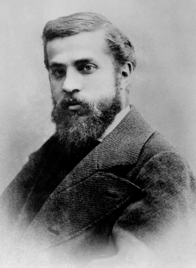
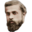
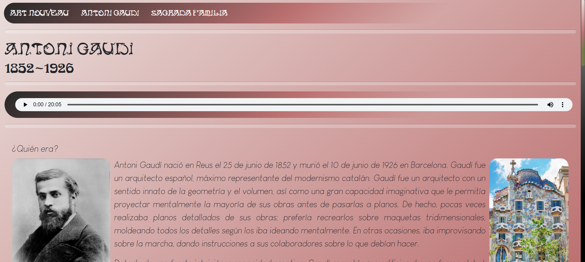
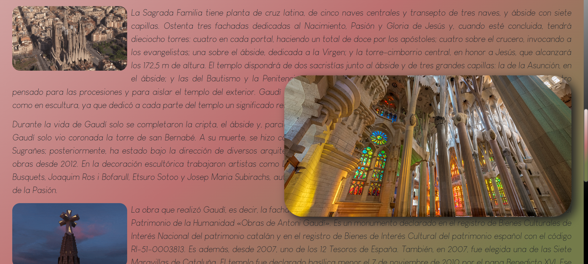

# Resumen
Sitio web tributo al Art Nouveau y Gaudí, caracterizado por una estética vibrante y colorida. Aunque nació como proyecto académico, expandí sus funcionalidades implementando scripts de JavaScript de forma autodidacta, añadiendo interactividad avanzada fuera del temario oficial.

# Art Nouveau
Un viaje visual por el modernismo catalán, combinando historia del arte y desarrollo web creativo.



Puedes visitar la web en funcionamiento aquí: **[🔗 Ver Proyecto Online](https://daicaluc.github.io/artnouveau/)**

---

## Contexto del Proyecto
Este sitio web fue desarrollado como entrega para la asignatura de **Desarrollo Web**. El objetivo era presentar información estructurada sobre el movimiento Art Nouveau y la influencia de Antoni Gaudí.

Sin embargo, tomé este proyecto como una oportunidad para **retarme a mí mismo**. No quería una web estática simple, así que decidí investigar e implementar funcionalidades dinámicas que no estaban incluidas en el plan de estudios original.

### Enfoque Visual
* **Estética Modernista:** Uso de colores vibrantes, formas orgánicas y tipografías que evocan la época.
* **Visualización Inmersiva:** Implementación de funciones de **Zoom y animaciones** sobre las imágenes. Esto permite al usuario explorar los detalles de las obras de arte rápidamente y con comodidad, sin romper el flujo de lectura ni obligarle a abrir nuevas pestañas.

---

## Valor Añadido: JavaScript Autodidacta
Aunque la asignatura solo requería HTML y CSS, decidí aprender e incorporar **JavaScript** para mejorar la experiencia de usuario.

Para aumentar la inmersión artística, desarrollé un script que gestiona el comportamiento del cursor y el feedback visual de las imágenes mediante la manipulación de clases del DOM.

La lógica se basa en la escucha de eventos nativos del ratón (addEventListener) para alternar estados CSS:

* **Estado Global html:** Detecta los eventos *mousedown* y *mouseup* para asignar la clase *.moving*. Esto permite cambiar el estilo del cursor globalmente cuando el usuario hace clic (efecto de "agarre" o interacción activa).
* **Estados Locales (Imágenes):** Al interactuar con elementos específicos (como *#image1* o *#image2*), el script gestiona eventos de entrada y salida (*mouseover*, *mouseout*) para asignar la clase *.pass*, indicando al usuario que el elemento es interactivo.

**Snippet de la lógica implementada:**
```javascript
// Ejemplo de gestión de estado al hacer clic
function onMouseDown(e) {
    // Añade feedback visual de "movimiento" al documento
    document.getElementsByTagName('html')[0].classList.add('moving');
    
    // Gestiona el estado específico del elemento clicado
    if (e.target.id != "") {
        document.getElementById(e.target.id).classList.remove('pass');
    }
}
```
Estos son los cursores utilizados y diseñados personalmente para implementar en la página.

| Cursor default | Cursor clic | Cursor zoom |
| :---: | :---: | :---: |
|  |  | 

---

## Tecnologías Utilizadas

* **HTML5:** Estructura semántica.
* **CSS3:** Diseño, paleta de colores y posicionamiento.
* **JavaScript (ES6):** Lógica del cliente e interactividad (Extra).
* **Photoshop:** Edición de imágenes para los cursores implementados.
* **Git & GitHub:** Control de versiones y despliegue.

---

## Galería

| Antoni Gaudí | Sagrada Família |
| :---: | :---: |
|  |  |

---

## Contacto
Si te interesa ver cómo combino la creatividad visual con el código, contáctame:

* [LinkedIn](linkedin.com/in/danicasadomanza)
* [Email](mailto:danicasadomanza@gmail.com)
